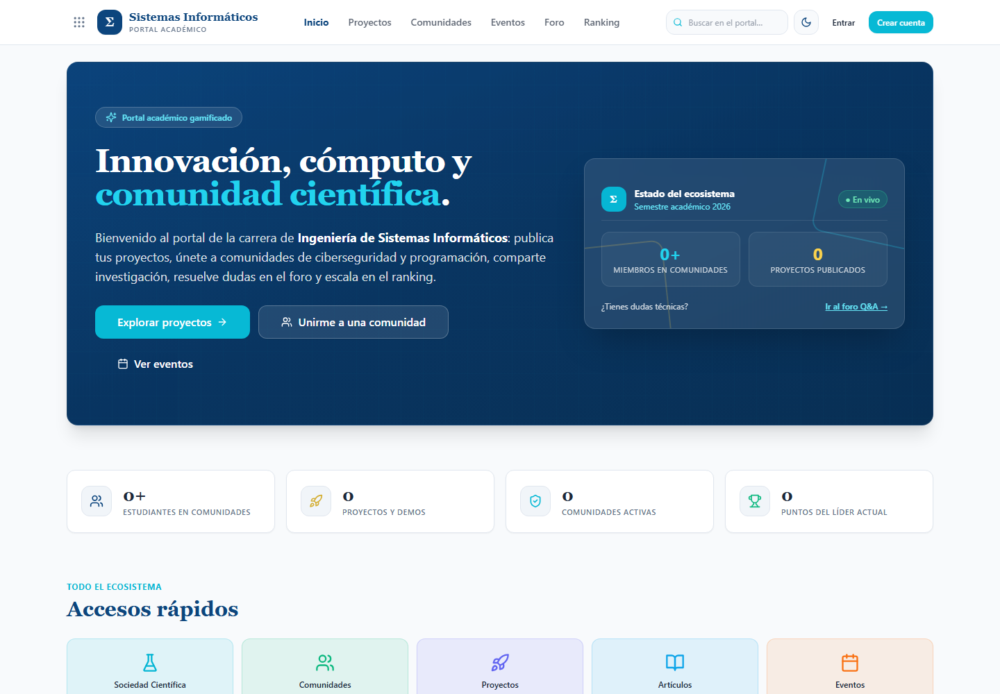
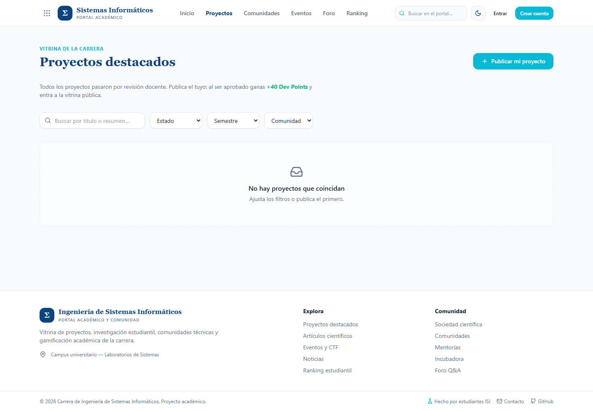

# Portal Académico ISI — Ingeniería de Sistemas Informáticos

[](https://github.com/BenjaminSM04/PaginaISI/actions/workflows/ci.yml)

Portal académico **gamificado** de la carrera: página institucional, sociedad científica, comunidades, vitrina de proyectos con aprobación docente, artículos científicos, eventos/CTF con inscripción, foro Q&A tipo Stack Overflow, sistema de puntos e insignias, rankings y panel de administración.

<picture>
  <source media="(max-width: 640px)" srcset="./home-mobile.png">
  
</picture>

<p align="center"><sub>Inicio institucional y accesos al ecosistema académico. El contenido mostrado depende del estado de la base local.</sub></p>

Para demostrar con los datos del seed la corrección, el reenvío y la aprobación de todo el contenido editorial, sigue la [`Guía de demostración`](docs/GUIA-DEMO.md#2-circuito-completo-de-aprobación-con-el-seed).

## Stack

| Capa | Tecnología |
|---|---|
| Frontend | Next.js 16 (App Router) · React 18 · TypeScript · Tailwind CSS · componentes estilo shadcn/ui · TanStack Query · React Hook Form + Zod |
| Backend | NestJS 11 · TypeScript · REST · Prisma ORM · JWT (access + refresh httpOnly) · Swagger |
| Base de datos | PostgreSQL 16 |
| Storage | Patrón Strategy: `local` (dev) o `s3` (S3/MinIO/Supabase/R2) |
| Despliegue | Docker Compose (db + api + web) |

Decisiones de arquitectura documentadas en [`docs/ADR-001-arquitectura.md`](docs/ADR-001-arquitectura.md). La separación entre demo lista y requisitos reales de Internet está en [`docs/PRODUCCION.md`](docs/PRODUCCION.md).

## Interfaz responsiva

### Vitrina de proyectos

<picture>
  <source media="(max-width: 640px)" srcset="./proyectos-mobile.png">
  
</picture>

### Sociedad Científica

<picture>
  <source media="(max-width: 640px)" srcset="./sociedad-mobile.png">
  
</picture>

## Inicio rápido con Docker (recomendado)

Requisitos: Docker Desktop.

1. Copia la configuración y genera tres secretos distintos. No uses valores de ejemplo en un despliegue real.

```powershell
Copy-Item .env.example .env
# Edita .env y completa POSTGRES_PASSWORD, JWT_ACCESS_SECRET y JWT_REFRESH_SECRET.
# Cada JWT puede generarse con: openssl rand -hex 32
```

2. Levanta el stack:

```bash
docker compose up --build
```

Eso levanta:

- **Web**: http://localhost:3000
- **API**: http://localhost:4000/api
- **Health/readiness**: http://localhost:4000/api/health

El API aplica las migraciones versionadas con `prisma migrate deploy`. PostgreSQL solo está disponible dentro de la red Docker; no se publica en el host. Swagger está desactivado en el contenedor de producción salvo que definas `ENABLE_SWAGGER=true`.

Con `SEED_ON_FIRST_RUN=true` (valor predeterminado de Compose), el primer arranque local carga automáticamente las cuentas y el contenido de demostración **solo si la tabla de usuarios está vacía**. Un bloqueo de PostgreSQL evita que dos réplicas intenten inicializar a la vez. En reinicios posteriores muestra `Seed inicial omitido` y no borra ni duplica nada. Si `WEB_ORIGIN` deja de ser loopback, el seed demo se bloquea salvo confirmación explícita con `ALLOW_DEMO_SEED=true`.

Para reemplazar manualmente una base demo descartable debes desactivar expresamente el modo inicial y confirmar el reset:

```bash
docker compose exec -e NODE_ENV=development -e SEED_ON_FIRST_RUN=false -e ALLOW_DEMO_SEED=true api npm run seed:demo
```

> **Advertencia:** el comando manual anterior borra todo el contenido existente. El seed automático, en cambio, nunca reinicia una base que ya tenga usuarios. Las credenciales demo son solo para una demostración local; cámbialas o desactiva `SEED_ON_FIRST_RUN` antes de publicar el sistema en Internet.

## Desarrollo local sin Docker

Requisitos: Node 20+, PostgreSQL 16 corriendo local.

```bash
# 1. Backend
cd backend
copy .env.example .env        # en Linux/Mac: cp .env.example .env  (ajusta DATABASE_URL)
npm ci
npm run db:deploy             # aplica las migraciones versionadas
# Solo para una BD demo descartable:
# PowerShell: $env:SEED_ON_FIRST_RUN='false'; $env:ALLOW_DEMO_SEED='true'; npm run seed:demo
# Bash: SEED_ON_FIRST_RUN=false ALLOW_DEMO_SEED=true npm run seed:demo
npm run start:dev             # http://localhost:4000  ·  Swagger en /docs

# 2. Frontend (otra terminal)
cd frontend
copy .env.example .env.local
npm ci
npm run dev                   # http://localhost:3000
```

Para crear una migración durante el desarrollo: `cd backend && npm run db:migrate`. En producción usa únicamente `npm run db:deploy`.

## Cuentas demo (seed)

Contraseña de **todas** las cuentas: `password123`

| Usuario | Email | Rol |
|---|---|---|
| admin | admin@isi.edu.bo | Administrador |
| rmendoza | rmendoza@isi.edu.bo | Docente revisor |
| lgutierrez | lgutierrez@isi.edu.bo | Docente revisor |
| avargas | avargas@est.isi.edu.bo | Estudiante + Líder de comunidad |
| dquispe | dquispe@est.isi.edu.bo | Estudiante + Líder de comunidad |
| jmamani, cflores, mrojas, pcondori | *@est.isi.edu.bo | Estudiantes |

El seed incluye: 6 comunidades, 10 noticias editoriales, 6 proyectos con 13 hitos y 12 imágenes, 4 artículos con PDF demostrable, 7 eventos con 18 inscripciones y 8 imágenes, 3 mentorías, 6 preguntas/respuestas con 5 imágenes, 10 insignias SVG, 93 movimientos de puntos y 33 entradas de auditoría colaborativa. Las cuentas demo nacen con correo verificado y el escenario valida sus propios contadores y límites antes de terminar.

Consulta el recorrido paso a paso en [`docs/GUIA-DEMO.md`](docs/GUIA-DEMO.md). Para la defensa de 10–15 minutos, usa el [guion de presentación final](docs/PRESENTACION-FINAL.md).

## Mapa del sistema

### Páginas (frontend)

| Ruta | Descripción |
|---|---|
| `/` | Home institucional: hero, stats, accesos rápidos (launcher), destacados, comunidades, top 5 |
| `/noticias`, `/noticias/[slug]` | Tabs de 10 recientes/top por likes, categorías y asociaciones a comunidad/evento |
| `/sociedad-cientifica` | Alias institucional conservado para enlaces anteriores |
| `/comunidades`, `/comunidades/[slug]`, `/comunidades/gestionar/*` | Switch Sociedad Científica/Comunidades, miembros, contenido y CRUD protegido para responsables |
| `/proyectos`, `/proyectos/[slug]`, `/proyectos/nuevo`, `/proyectos/editar/[id]` | Vitrina, publicación, observaciones, corrección y reenvío |
| `/proyectos/gestionar`, `/proyectos/gestionar/[id]` | Workspace por proyecto: ficha, calendario, noticias, galería y trazabilidad según membresía |
| `/articulos`, `/articulos/[slug]`, `/articulos/nuevo`, `/articulos/editar/[id]` | Revisión y detalle con tabs Resumen/PDF y visor integrado |
| `/eventos`, `/eventos/[slug]`, `/eventos/[slug]/editar`, `/eventos/nuevo` | Inscripción, Google Calendar, edición, asistencia, galería WebP con borrado y CSV |
| `/incubadora` | Proyectos incubados y equipos reclutando |
| `/mentorias`, `/mentorias/[slug]`, `/mentorias/nueva`, `/mentorias/gestionar` | Inscripción y gestión completa por mentor/líder/admin |
| `/foro`, `/foro/[id]`, `/foro/preguntar` | Q&A: tags libres (máx. 5), filtros, votos y hasta 2 fotos por pregunta/respuesta |
| `/ranking` | Podio + tabla por categoría (general/dev/research/community) e histórico/mensual + catálogo de insignias |
| `/perfil/[username]` | Perfil público: puntos, insignias, proyectos, artículos, actividad |
| `/cuenta` | Perfil, publicaciones, revisión, puntos y seguridad (correo, contraseña y sesiones) |
| `/buscar` | Buscador global |
| `/login`, `/registro`, `/olvide-contrasena`, `/restablecer-contrasena`, `/verificar-correo` | Autenticación y recuperación/verificación segura |
| `/notificaciones` | Bandeja persistente, no leídas y preferencias por categoría |
| `/revision` | Panel docente con contenido completo: aprobar/observar/rechazar |
| `/admin/*` | Usuarios, noticias, reportes, gamificación y auditoría/rollback de proyectos |

### Roles

- **Visitante**: ve todo el contenido público.
- **Estudiante (STUDENT)**: publica proyectos/artículos (quedan pendientes), pregunta/responde/vota, se inscribe a eventos y mentorías, gana puntos e insignias.
- **Docente (TEACHER)**: revisa y aprueba/observa/rechaza en `/revision`; puede crear eventos.
- **Líder de comunidad (COMMUNITY_LEADER)**: administra su comunidad, crea eventos, ve inscritos.
- **Admin (ADMIN)**: control total en `/admin`, acceso a todos los proyectos y rollback auditado en `/admin/auditoria`.

### Flujo de aprobación

`BORRADOR → PENDIENTE → APROBADO / OBSERVADO / RECHAZADO → ARCHIVADO`

1. El estudiante publica y elige docente revisor → estado `PENDIENTE` (invisible al público).
2. El docente aprueba (+40 pts proyecto / +35 artículo, insignias automáticas), observa (devuelve con comentarios) o rechaza.
3. Si fue observado, el autor corrige y reenvía (`resubmit`). Cada ciclo queda auditado en `ApprovalRequest`.

### Gamificación

Todo punto es una fila en `PointsTransaction` (auditable); los agregados viven en `Profile`. Reglas editables desde el admin:

| Acción | Puntos | Categoría |
|---|---|---|
| Registro completo | +10 | Community |
| Unirse a comunidad | +5 | Community |
| Inscribirse a evento | +5 | Community |
| Pregunta publicada | +5 | Dev |
| Responder pregunta | +10 | Dev |
| Respuesta aceptada | +30 | Dev |
| Proyecto aprobado | +40 | Dev |
| Artículo aprobado | +35 | Research |
| Like recibido | +1 (límite diario 20) | Community |
| Reporte válido | +5 | Community |
| Spam confirmado | −15 | Community |

Anti-abuso: sin self-like/self-vote, voto único por usuario y contenido (constraint en DB), acreditación idempotente por hecho (constraint único en el ledger), límites diarios, sanitización de HTML y rate limiting global.

## API

En desarrollo local, la documentación Swagger está en `http://localhost:4000/docs`. En Docker debes cambiar `ENABLE_SWAGGER=true` en `.env` si la necesitas. Autentícate con *Authorize* usando el `accessToken` devuelto por `/api/auth/login`.

Resumen de módulos: `auth`, `users`, `notifications`, `news`, `communities`, `projects`, `articles`, `events`, `mentorships`, `forum`, `ranking/badges/points`, `reports`, `media`, `search`, `admin`.

## Storage de archivos

`STORAGE_DRIVER=local` guarda en `backend/uploads/` (servido en `/uploads/*`). Para migrar a la nube solo cambia variables:

```env
STORAGE_DRIVER=s3
S3_ENDPOINT=https://<minio-o-supabase>   # vacío para AWS S3
S3_REGION=us-east-1
S3_BUCKET=isi-portal
S3_ACCESS_KEY=...
S3_SECRET_KEY=...
S3_PUBLIC_URL=https://cdn.midominio.com  # opcional
STORAGE_BYTES_PER_USER=262144000          # 250 MiB
CLEAN_ORPHAN_UPLOADS_ON_START=true
# Opcional: receptor que materializa alertas de edición por correo
SECURITY_ALERT_WEBHOOK_URL=https://automatizacion.example.com/isi/security-alert
SECURITY_ALERT_WEBHOOK_SECRET=<secreto-independiente-de-32-o-mas-bytes>
```

Endpoint: `POST /api/media/upload` (multipart, campo `file`; png/jpg/webp/gif/pdf, máx. 8 MB de entrada).

Toda imagen aceptada se decodifica y vuelve a codificar como WebP, se limita a 1920 px, pierde EXIF/GPS y debe quedar por debajo de 5 MB. También se limitan píxeles y fotogramas para evitar imágenes bomba. Preguntas/respuestas aceptan 2 imágenes y las galerías de eventos 12. Hay cuota total por usuario, consulta de consumo, eliminación física al borrar fotos y limpieza conservadora de huérfanos no referenciados. El conversor de insignias es un endpoint ADMIN separado: recibe un raster pequeño y genera rutas SVG con gramática cerrada; nunca acepta XML/SVG arbitrario.

## Seguridad implementada

JWT access (15 min) + refresh rotatorio por dispositivo en cookie `httpOnly`, `SameSite=Lax` y `Secure` bajo HTTPS; listado y revocación inmediata de sesiones; secretos obligatorios y validados; issuer/audience/tipo/algoritmo HS256; tokens de verificación/recuperación aleatorios, hasheados, expirables y de un solo uso; invalidación total tras restablecer contraseña; RBAC global; throttling reforzado; DTOs con lista blanca estricta; sanitización HTML; URLs HTTP(S) validadas; firma binaria y cuota para archivos; Helmet y CSP; CORS por allowlist; constraints anti-duplicado; migraciones reproducibles; contenedores sin root y PostgreSQL sin puerto público.

Los proyectos y artículos aprobados vuelven automáticamente a revisión si su autor cambia contenido público. Los colaboradores explícitamente asociados pueden editar ficha, hitos, noticias e imágenes del proyecto, pero no integrantes, revisor, comunidad, estado ni destacado. Cada mutación exige la versión leída, usa compare-and-set, guarda snapshots y correo del actor en una bitácora append-only y crea un outbox de aviso; solo ADMIN puede consultar el historial completo y ejecutar rollback con motivo y detección de conflictos. Los enlaces privados de eventos y mentorías solo se entregan a inscritos u organizadores autorizados. Las exportaciones CSV neutralizan fórmulas, los SVG personalizados no se insertan como HTML y los archivos se reencodifican antes de publicarse.

## Verificación y operación

Antes de una demostración, ejecuta desde la raíz el preflight PowerShell automatizado. Comprueba los tres contenedores, health/base de datos, catálogos públicos, páginas principales y acceso al dashboard con rol ADMIN:

```powershell
./scripts/verificar-demo.ps1
```

Usa `password123` por defecto. Si cambiaste la contraseña demo del administrador, pásala temporalmente mediante `DEMO_ADMIN_PASSWORD` sin guardarla en el repositorio:

```powershell
$env:DEMO_ADMIN_PASSWORD = Read-Host 'Contraseña demo ADMIN' -MaskInput
try { ./scripts/verificar-demo.ps1 } finally { Remove-Item Env:DEMO_ADMIN_PASSWORD -ErrorAction SilentlyContinue }
```

El preflight se detiene en la primera comprobación fallida y muestra el componente que debe revisarse. Para verificar ADMIN realiza login y logout garantizado: no altera contenido demo ni deja una sesión activa, aunque la sesión revocada permanece registrada como trazabilidad.

```bash
# Backend: typecheck, build y pruebas de seguridad
cd backend
npm run check
npm audit --omit=dev

# Frontend: typecheck, ESLint y build de producción
cd ../frontend
npm run check
npm audit --omit=dev

# Estado de Docker
cd ..
docker compose ps
docker compose logs -f api web
```

Para detener sin borrar datos: `docker compose down`. Para borrar también la base y uploads locales: `docker compose down -v` (acción destructiva).

## Fase 2 completada

- Switches segmentados accesibles para cambiar vistas dentro de la misma página.
- Notificaciones persistentes por revisión, foro, eventos y mentorías, con preferencias.
- Recuperación/cambio de contraseña, verificación de correo y sesiones por dispositivo.
- Panel de comunidades, edición completa de eventos, asistencia y borrado de galería.
- Upload directo de portadas/PDF, cuota por bytes y limpieza segura de huérfanos.

Siguiente bloque recomendado: E2E automatizado en CI, observabilidad/auditoría, backups restaurables, estadísticas históricas y SSO institucional si existe proveedor.

## Notas

- Datos del seed son ficticios (nombres, URLs de ejemplo). No hay datos sensibles reales.
- Los mockups de referencia están en `mockups/` (ignorado por git).
