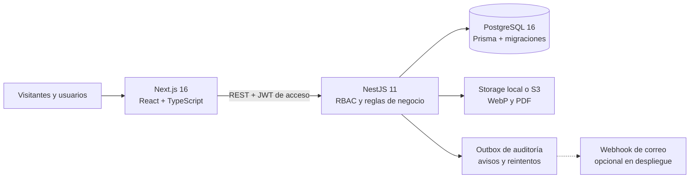

# Presentación final del Portal Académico ISI

Este documento es el guion operativo para una defensa de **10 a 15 minutos**. Está basado en las rutas, permisos y datos que existen en el proyecto. La demostración recomendada cuenta una sola historia de extremo a extremo: una publicación pasa por revisión docente, el estudiante recibe el resultado y la gamificación se actualiza, mientras líderes y administradores operan el resto del portal.

> La plataforma está lista para una presentación funcional local. No debe presentarse todavía como un servicio público en producción: correo real, dominio/TLS, backups, observabilidad, políticas institucionales y E2E en CI siguen siendo trabajo de despliegue, no funciones simuladas.

## Mensaje central

### Presentación en 30 segundos

> El Portal ISI integra en una sola plataforma la información institucional y la actividad académica de la carrera. Los estudiantes publican proyectos y artículos, participan en comunidades, eventos, mentorías y foro; los docentes revisan contenido con trazabilidad; y la administración modera, comunica y gestiona la gamificación. No es un conjunto de páginas estáticas: los módulos comparten usuarios, permisos, notificaciones, puntos y relaciones entre contenido.

### Problema y respuesta

- **Problema:** información dispersa, poca visibilidad del trabajo estudiantil y procesos manuales sin trazabilidad.
- **Respuesta:** un portal único con identidad, roles, revisión, comunidades, agenda, conocimiento colaborativo y reconocimiento verificable.
- **Diferenciador:** una acción en un módulo produce efectos consistentes en otros. Por ejemplo, aprobar un artículo lo publica, registra la decisión, acredita puntos y notifica al autor.

## Arquitectura para explicar en una lámina



Cómo narrarlo:

1. Next.js resuelve la experiencia pública y las vistas interactivas.
2. NestJS es la única autoridad para permisos y reglas de negocio; ocultar un botón en el frontend no sustituye el control del API.
3. PostgreSQL persiste contenido, historial de aprobaciones, sesiones, notificaciones y el ledger de puntos.
4. El storage usa una estrategia intercambiable: local para la demo y S3-compatible para despliegue.
5. Docker Compose reproduce la solución con `db`, `api` y `web`, migraciones y seed inicial idempotente.

## Acceso y cuentas de demostración

Portal: <http://localhost:3000>

El formulario de `/login` acepta **correo o username**. Todas las cuentas del seed usan `password123` y nacen con correo verificado.

| Perfil | Correo | Username | Qué conviene demostrar |
|---|---|---|---|
| Administrador | `admin@isi.edu.bo` | `admin` | Dashboard, reportes, noticias, usuarios y gamificación |
| Docente | `rmendoza@isi.edu.bo` | `rmendoza` | Proyecto y artículo pendientes asignados |
| Docente | `lgutierrez@isi.edu.bo` | `lgutierrez` | Comunidades asesoradas e historial del proyecto observado |
| Líder/estudiante | `avargas@est.isi.edu.bo` | `avargas` | HackLab, CTF, inscritos, galería y notificación de evento |
| Líder/estudiante | `dquispe@est.isi.edu.bo` | `dquispe` | Cloud ISI, evento Docker y mentoría AWS |
| Estudiante/colaborador | `pcondori@est.isi.edu.bo` | `pcondori` | Proyecto observado, Biblioteca como colaborador, calendario, noticias, notificaciones y seguridad |
| Estudiante | `mrojas@est.isi.edu.bo` | `mrojas` | Proyecto pendiente y mentoría de nivelación |
| Estudiantes | `jmamani@est.isi.edu.bo`, `cflores@est.isi.edu.bo` | `jmamani`, `cflores` | Proyectos, artículos, foro, puntos e insignias ya aprobados |

Para no perder tiempo cerrando sesión, preparar perfiles de navegador separados:

- ventana pública sin sesión;
- perfil **Docente** con `rmendoza`;
- perfil **Estudiante** con `pcondori`;
- perfil **Líder** con `avargas`;
- perfil **Admin** con `admin`.

Una ventana de incógnito comparte cookies entre sus propias pestañas; no sirve para mantener varias cuentas simultáneas. Usar perfiles distintos, navegadores diferentes o contenedores de Firefox.

## Estado reproducible del seed

Una base nueva contiene el siguiente escenario:

| Módulo | Datos preparados |
|---|---|
| Usuarios | 9 cuentas y 4 clases de rol |
| Comunidades | 6 comunidades activas con responsables y membresías |
| Noticias | 10 publicadas; 2 ligadas directamente a proyectos, además de asociaciones a comunidades/eventos |
| Proyectos | 6 totales: 4 aprobados, 1 pendiente y 1 observado; 13 hitos y 12 imágenes |
| Artículos | 4 totales: 3 aprobados y 1 pendiente |
| Eventos | 7, con fechas relativas al seed; 8 imágenes de galería y 18 inscripciones |
| Mentorías | 3 con mentor, comunidad, temario e inscripciones |
| Foro | 6 preguntas y 6 respuestas, votos, aceptadas y 5 imágenes dentro de sus límites |
| Gamificación | 10 insignias, 18 asignaciones y 93 movimientos de puntos auditables |
| Notificaciones | 8 ejemplos distribuidos entre admin, estudiantes y líder |
| Gestión colaborativa | 33 auditorías con correo/snapshots, versiones, estados de entrega y rollback demostrable |
| Moderación | 1 reporte pendiente para el administrador |

En una base recién creada, el dashboard muestra **4 proyectos aprobados + 1 pendiente** y **3 artículos aprobados + 1 pendiente**; el proyecto observado completa el total de seis. Si durante la demo se aprueba el artículo pendiente, la cifra cambia a **4 aprobados + 0 pendientes**.

### Contenido clave para abrir sin buscar

| Objetivo | Ruta o dato exacto |
|---|---|
| Switch Sociedad/Comunidades | `/comunidades` |
| Comunidad del líder Andrea | `/comunidades/ciberseguridad` |
| Artículo con visor PDF | `/articulos/deteccion-retinopatia-diabetica-cnn` |
| Evento con galería y Calendar | `/eventos/ctf-isi-2026` |
| Top de noticias | `/noticias?orden=top` |
| Proyecto público destacado | `/proyectos/sistema-gestion-biblioteca` |
| Workspace colaborativo | `/proyectos/gestionar` con `pcondori` para Biblioteca |
| Auditoría y rollback | `/admin/auditoria` con `admin` |
| Proyecto observado de Pablo | `/cuenta?tab=proyectos` con `pcondori` |
| Artículo pendiente de Pablo | `Benchmark de ORMs TypeScript sobre PostgreSQL` en `/revision` |
| Proyecto pendiente de María | `Tutor virtual de algoritmos` en `/revision` |
| Gestión de HackLab | `/comunidades/gestionar` con `avargas` |
| Gestión del CTF | `/eventos/ctf-isi-2026` con `avargas` |

## Preparación técnica

### El día anterior

1. Confirmar que Docker Desktop, el navegador e Internet funcionen.
2. Ejecutar los checks del proyecto:

```powershell
cd backend
npm run check
npm audit --omit=dev
cd ../frontend
npm run check
npm audit --omit=dev
cd ..
```

3. Si la base es exclusivamente de demostración y se necesita recuperar el estado exacto del seed, hacer el reset **antes**, nunca durante la defensa:

```powershell
docker compose down -v
docker compose up -d --build
docker compose ps
```

> `docker compose down -v` elimina la base y los uploads. No usarlo si existe información que se deba conservar.

4. Preparar los perfiles de navegador y abrir las rutas de la sección anterior.
5. Si se mostrará compresión, disponer de una fotografía JPEG/PNG de 1 a 5 MB que no contenga datos personales.
6. Confirmar que el PDF externo de arXiv y Google Calendar abren desde la red de la presentación.

### Treinta minutos antes

```powershell
docker compose up -d --build
./scripts/verificar-demo.ps1
```

El preflight no modifica el contenido demo y comprueba contenedores, API/PostgreSQL, catálogos, páginas principales e identidad/rol ADMIN. Para esta última comprobación realiza login y logout garantizado: no deja una sesión activa, aunque conserva la fila revocada como trazabilidad. Si la clave de `admin@isi.edu.bo` ya no es `password123`, suministrarla temporalmente sin editar el script ni el repositorio:

```powershell
$env:DEMO_ADMIN_PASSWORD = Read-Host 'Contraseña demo ADMIN' -MaskInput
try { ./scripts/verificar-demo.ps1 } finally { Remove-Item Env:DEMO_ADMIN_PASSWORD -ErrorAction SilentlyContinue }
```

Si una comprobación falla, el script se detiene y muestra `[ERROR]`. Recién entonces consultar el diagnóstico detallado:

```powershell
docker compose ps
docker compose logs --tail=100 api web db
```

Criterios de aceptación:

- `db`, `api` y `web` aparecen `healthy`;
- health responde con `status: ok` y `database: up`;
- <http://localhost:3000> responde y permite navegar;
- el preflight termina con `Preflight completo` y todas sus comprobaciones en `[OK]`;
- las cinco cuentas preparadas inician sesión;
- `/revision` muestra el artículo de ORMs si se usará la aprobación en vivo.

Para comprobar el seed en PowerShell:

```powershell
docker compose logs api | Select-String -Pattern 'Primera base|Seed inicial|Seed completado'
```

`Seed inicial omitido` en un reinicio es el comportamiento correcto: significa que se conservaron los datos.

### Cinco minutos antes

- Cerrar pestañas, notificaciones del sistema y programas que puedan interrumpir.
- Usar zoom del navegador entre 90 % y 110 % y comprobar el proyector.
- Dejar cada perfil en su primera ruta, sin formularios parcialmente llenos.
- Tener una terminal abierta en la raíz con `docker compose ps` ya ejecutado.
- Mantener este guion abierto en otra pantalla o impreso.

## Guion principal de 14 minutos

| Tiempo | Perfil y ruta | Acción visible | Idea que se comunica |
|---:|---|---|---|
| 0:00–0:45 | Sin navegador | Presentar problema, usuarios y objetivo | Es una plataforma académica integrada |
| 0:45–1:45 | Público `/` | Home, destacados, accesos y ranking | El contenido útil está disponible sin iniciar sesión |
| 1:45–2:45 | Público `/comunidades` y `/noticias` | Cambiar switches dentro de la página | La navegación agrupa vistas relacionadas sin duplicarlas |
| 2:45–4:15 | Público artículo y CTF | Resumen/PDF, galería y Google Calendar | Investigación, eventos y noticias están relacionados |
| 4:15–6:15 | Docente `/revision` | Abrir artículo pendiente y aprobarlo | Existe revisión real, trazable y con RBAC |
| 6:15–8:30 | Estudiante `/notificaciones` y `/cuenta` | Ver aprobación, puntos y proyecto observado | Una acción docente cruza notificación, estado y gamificación |
| 8:30–10:15 | Colaborador `/proyectos/gestionar` | Switches, calendario, noticia e imagen del proyecto Biblioteca | El equipo edita solo sus proyectos y sin perder cambios concurrentes |
| 10:15–11:15 | Líder CTF y `/comunidades/gestionar` | Inscritos, asistencia, CSV, galería y comunidad | Los responsables operan solo sus espacios |
| 11:15–12:30 | Admin `/admin/auditoria` y `/admin/gamificacion` | Correo del actor, snapshots, rollback, Insignias/Puntos | Hay gobierno y trazabilidad, no solo publicación |
| 12:00–13:15 | Lámina de arquitectura | Explicar seguridad, datos y Docker | Las decisiones técnicas sostienen los flujos mostrados |
| 13:15–14:00 | Cierre | Resultado, límites y siguiente paso | Es una base funcional y extensible para adopción institucional |

### 1. Experiencia pública

En `/`:

1. Señalar el encabezado, el launcher de aplicaciones y el buscador global.
2. Mostrar noticias, proyectos, eventos y comunidades destacadas.
3. Explicar que los visitantes solo ven publicaciones aprobadas; pendientes y observadas permanecen privadas para autor/revisor/admin.

En `/comunidades`:

1. La vista inicial corresponde a **Sociedad Científica**.
2. Pulsar el switch **Comunidades**. La vista cambia dentro de la misma página y la URL queda compartible con `?vista=comunidades`.
3. Abrir HackLab para mostrar responsable docente, líder, miembros, eventos, proyectos y noticias relacionados.

En `/noticias`:

1. Alternar **10 más recientes** y **Más valoradas**.
2. Señalar que las noticias pueden enlazar una comunidad y un evento.

Frase sugerida:

> Los switches no son rutas disfrazadas: mantienen el contexto de la página, exponen semántica de tabs para teclado y permiten compartir el estado relevante en la URL.

### 2. Artículo científico y evento

Abrir `/articulos/deteccion-retinopatia-diabetica-cnn`:

1. Mostrar autores, área, resumen e impacto.
2. Cambiar de **Resumen** a **Visor de PDF**.
3. Explicar que el visor está integrado en la misma página y conserva una salida para abrir el documento original.

Abrir `/eventos/ctf-isi-2026`:

1. Mostrar comunidad organizadora, cupos, cuenta regresiva y galería.
2. Señalar **Agregar a Google Calendar**.
3. No iniciar sesión todavía: los enlaces privados de reuniones no se entregan indiscriminadamente.

### 3. Flujo docente en vivo

Usar `rmendoza@isi.edu.bo` en `/revision`:

1. Mostrar los switches **Proyectos** y **Artículos**.
2. En Artículos abrir **Revisar contenido completo** en `Benchmark de ORMs TypeScript sobre PostgreSQL`.
3. Señalar autor, área, tags, contenido y docente asignado.
4. Pulsar **Aprobar (+35 pts al autor)**.
5. La tarjeta desaparece de pendientes. La operación cambia el estado, cierra la solicitud de aprobación, acredita puntos idempotentes y crea una notificación persistente.

Esta es la única mutación imprescindible del recorrido. Si se prefiere mostrar una devolución, escribir:

> Agregar metodología de medición, versión de PostgreSQL y resultados reproducibles.

y pulsar **Observar**. En ese caso no se acreditan puntos, pero el estudiante recibe la observación y puede corregir/reenviar.

No aprobar y observar el mismo contenido: después de la primera decisión deja de estar pendiente.

### 4. Resultado para el estudiante

Cambiar al perfil `pcondori@est.isi.edu.bo`:

1. El indicador de campana muestra notificaciones no leídas.
2. En `/notificaciones`, cambiar entre **Todas**, **No leídas** y **Preferencias**.
3. Abrir la notificación `Tu artículo fue aprobado`. Lleva a `/cuenta?tab=articulos`.
4. Mostrar el estado aprobado y los `+35 pts`; luego abrir **Historial de puntos**.
5. En `/cuenta?tab=proyectos`, mostrar `Sistema de votación estudiantil con blockchain`, la observación sembrada y **Corregir y reenviar**.
6. En **Seguridad**, señalar correo verificado, cambio de contraseña y sesiones por dispositivo.

### 5. Edición colaborativa y supervisión

Mantener el perfil `pcondori` y abrir `/proyectos/gestionar`:

1. Mostrar que puede gestionar su proyecto de votación y también **Sistema de Gestión de Biblioteca**, donde es colaborador Backend.
2. Dentro de Biblioteca cambiar entre **Datos / Calendario / Noticias / Imágenes**. El seed ya contiene dos hitos, tres imágenes y una noticia ligada al proyecto.
3. Editar un hito pequeño o crear una noticia. Explicar que cada mutación exige la versión leída y un segundo formulario desactualizado recibe `409` en lugar de sobrescribir.
4. Señalar que Pablo no ve controles de integrantes, revisor, comunidad, estado ni destacado.

Cambiar a `admin` y abrir `/admin/auditoria`:

1. Buscar `pcondori` o `Biblioteca` y abrir la gestión desde la entrada.
2. Mostrar correo snapshot del actor, acción, fecha, señal de riesgo y estado del aviso interno/webhook.
3. Si se hizo una edición preparada para revertir, pulsar rollback, escribir un motivo de al menos diez caracteres y confirmar. La reversión crea otra entrada: nunca borra la evidencia original.

Frase sugerida:

> La colaboración no se basa en esconder botones: el API valida la membresía, compara la versión y guarda la mutación y su auditoría en la misma transacción. El administrador puede reconstruir qué ocurrió y revertir únicamente un estado todavía compatible.

No cambiar la contraseña durante el guion principal: invalidaría las otras sesiones de ese usuario y dejaría de coincidir con las credenciales impresas. La revocación es una buena demostración opcional si se prepararon dos sesiones de `pcondori`.

### 6. Operación del líder

Usar `avargas@est.isi.edu.bo`:

1. En `/comunidades/gestionar` se muestra HackLab, la comunidad que lidera, no las comunidades ajenas.
2. En `/eventos/ctf-isi-2026`, abrir **Gestión de inscritos**: el seed contiene cuatro inscripciones.
3. Marcar asistencia de una persona y mostrar el contador.
4. Señalar la exportación CSV. Los valores que podrían convertirse en fórmulas se neutralizan antes de descargar.
5. En la galería aparecen **Editar evento**, **Agregar fotos** y eliminación solo para responsables.

Demostración opcional de compresión (+60 segundos):

1. Subir la fotografía preparada.
2. Leer el mensaje `tamaño original → tamaño almacenado en WebP`.
3. Explicar máximo de 1920 px, eliminación de EXIF/GPS y límites contra imágenes bomba.
4. Eliminar esa misma foto y mostrar que se libera también el archivo físico.

### 7. Gobierno administrativo

Usar `admin@isi.edu.bo`:

1. En `/admin`, contrastar métricas y pendientes. Tras la aprobación en vivo deben existir cuatro artículos aprobados y ninguno pendiente.
2. En `/admin/reportes`, mostrar el reporte sembrado y las alternativas: validar, validar con penalización o descartar. No es necesario resolverlo.
3. En `/admin/gamificacion`, cambiar el switch **Insignias/Puntos**.
4. En Insignias mostrar los iconos SVG, editor, otorgamiento por username y conversor raster → SVG seguro.
5. En Puntos mostrar reglas, categorías y límites diarios.

Frase sugerida:

> El puntaje no se edita como un número opaco: cada cambio nace de una transacción con motivo, categoría y fuente, lo que permite auditar y evitar doble acreditación.

### 8. Cierre técnico

Resumir sin abrir código:

- access token corto en memoria y refresh rotatorio por dispositivo en cookie `httpOnly`;
- RBAC y propiedad comprobados en backend;
- migraciones versionadas y seed inicial no destructivo;
- sanitización, validación estricta, límites y cuotas de archivos;
- PostgreSQL para integridad relacional y trazabilidad;
- storage local/S3 intercambiable;
- contenedores con healthchecks, sin publicar PostgreSQL al host.

Cierre sugerido:

> La entrega demuestra el ciclo completo de una comunidad académica: producir, revisar, publicar, participar, reconocer y administrar. La siguiente etapa no es inventar pantallas faltantes, sino desplegar con los servicios institucionales de correo, identidad, backups y monitoreo.

## Recorrido exacto por rol

| Rol | Rutas principales | Acciones autorizadas |
|---|---|---|
| Visitante | `/`, `/noticias`, `/comunidades`, `/proyectos`, `/articulos`, `/eventos`, `/foro`, `/ranking`, `/mentorias`, `/buscar` | Consultar únicamente contenido público/aprobado |
| Estudiante | `/cuenta`, `/notificaciones`, `/proyectos/nuevo`, `/articulos/nuevo`, `/foro/preguntar` | Publicar, corregir/reenviar, votar, responder, inscribirse, gestionar sesiones |
| Docente | `/revision`, `/eventos/nuevo`, `/mentorias/nueva`, `/comunidades/gestionar` | Revisar lo asignado, crear eventos/mentorías y gestionar comunidades asesoradas |
| Líder | `/comunidades/gestionar`, `/eventos/nuevo`, `/eventos/[slug]/editar`, `/mentorias/gestionar` | Gestionar comunidades propias, eventos, galerías, inscritos y mentorías autorizadas |
| Admin | `/admin`, `/admin/usuarios`, `/admin/noticias`, `/admin/reportes`, `/admin/gamificacion`, `/revision` | Gobierno global, moderación, reglas, insignias, roles y contenido |

Los controles de UI ayudan a orientar, pero el API vuelve a validar rol, propiedad, asignación y estado. Intentar escribir directamente al endpoint no permite saltar estas reglas.

## Versión reducida de 10 minutos

Si el jurado limita el tiempo:

1. Home y switches de Comunidades: 90 segundos.
2. Artículo con PDF y evento con Calendar: 90 segundos.
3. Docente aprueba el artículo: 2 minutos.
4. Estudiante recibe notificación y puntos: 2 minutos.
5. Admin muestra dashboard y gamificación: 90 segundos.
6. Arquitectura, seguridad, límites y cierre: 90 segundos.

Omitir líder, upload, asistencia, CSV y reportes; conservarlos como respuesta a preguntas.

## Contingencias

| Situación | Qué hacer en el momento | Qué no hacer |
|---|---|---|
| Un contenedor no está healthy | Ejecutar `docker compose ps` y `docker compose logs --tail=100 api web db`; usar las pestañas ya cargadas mientras se identifica el servicio | No borrar volúmenes en vivo |
| No se puede iniciar sesión | Confirmar que el campo contiene email/username exacto y `password123`; probar un perfil limpio y revisar health | No cambiar contraseñas al azar |
| El artículo ya no aparece pendiente | La demo ya fue ejecutada. Mostrar el historial/estado resultante y el proyecto observado de `pcondori` | No resetear la base durante la defensa |
| El PDF externo no carga | Mantener el tab Resumen, explicar que el seed usa arXiv y abrir el enlace original si vuelve la red | No afirmar que el PDF está almacenado localmente |
| Imágenes remotas no cargan | Continuar con texto, estados y datos; usar una imagen local preparada para demostrar upload | No depender de Unsplash para explicar la función |
| Google Calendar no abre | Mostrar el botón y explicar que genera una URL con título, fechas, descripción y ubicación | No iniciar un flujo de autenticación largo |
| El navegador conserva una cuenta equivocada | Cambiar al perfil de navegador correcto o cerrar sesión desde el menú | No mantener varias cuentas en el mismo perfil |
| Falta tiempo | Aplicar la versión reducida de 10 minutos | No acelerar todos los módulos sin una historia común |
| Una mutación falla | Leer el mensaje, mostrar que el estado anterior se conserva y pasar a los datos sembrados | No ocultar el error ni repetir clics rápidamente |
| El seed dice `omitido` | Continuar: preservó una base no vacía, como fue diseñado | No asumir que es un fallo |

Plan visual de respaldo: capturar antes de la defensa Home, Revisión, Notificaciones, CTF y Dashboard. Las capturas no reemplazan la demo, pero permiten explicar el resultado si el equipo o proyector falla.

## Checklist

### Antes de salir a presentar

- [ ] Checks de backend y frontend terminan con código 0.
- [ ] Auditorías de dependencias no reportan vulnerabilidades de producción.
- [ ] `./scripts/verificar-demo.ps1` termina con `Preflight completo`.
- [ ] `db`, `api` y `web` están `healthy`.
- [ ] Health confirma conexión a PostgreSQL.
- [ ] El seed tiene el estado esperado o el guion se adaptó al estado existente.
- [ ] Credenciales probadas en perfiles separados.
- [ ] Artículo PDF, imágenes externas y Google Calendar probados con la red disponible.
- [ ] Archivo de imagen opcional preparado y sin información sensible.
- [ ] No hay secretos ni `.env` visibles en las pestañas o terminal.
- [ ] Capturas de contingencia disponibles sin Internet.
- [ ] Cargador, adaptador de video y hotspot disponibles.

### Durante la presentación

- [ ] Empezar por el problema, no por el stack.
- [ ] Mantener una historia de extremo a extremo.
- [ ] Decir en voz alta qué rol está activo.
- [ ] Ejecutar una sola aprobación/observación planificada.
- [ ] Diferenciar datos demo de datos institucionales reales.
- [ ] No mostrar tokens, cookies, secretos ni datos personales.
- [ ] Señalar qué cambia en otros módulos después de la acción.
- [ ] Reservar al menos un minuto para arquitectura, seguridad y límites.

### Después

- [ ] Registrar preguntas, errores o mejoras detectadas.
- [ ] Si se subió una imagen de prueba, eliminarla desde la galería.
- [ ] Si se cambiaron reglas, roles o contraseñas, documentar o revertir el cambio.
- [ ] Para conservar los datos, detener con `docker compose down` sin `-v`.
- [ ] Antes de cualquier publicación externa, retirar cuentas demo, desactivar seed y enlaces de desarrollo, y rotar secretos.

## Preguntas técnicas esperables

### ¿Por qué Next.js, NestJS y PostgreSQL?

Next.js cubre páginas públicas y UI interactiva con un mismo proyecto; NestJS estructura módulos, validación, guards y documentación REST; PostgreSQL aporta transacciones, constraints, arrays/indexación de tags y relaciones consistentes. Es una arquitectura modular suficiente para el alcance sin añadir la complejidad operativa de microservicios.

### ¿La autorización depende del frontend?

No. El frontend oculta o muestra acciones para mejorar UX, pero NestJS valida autenticación, roles, propiedad, docente asignado y estado del recurso. Por ejemplo, un docente no puede revisar un artículo asignado a otro y un líder solo gestiona comunidades/eventos autorizados.

### ¿Dónde se guardan los JWT?

El access token vive en memoria del frontend y dura poco. El refresh se guarda en cookie `httpOnly`, no en `localStorage`; rota por dispositivo y su sesión persiste con hash, expiración absoluta y revocación. El cliente deduplica refreshes concurrentes.

### ¿Qué ocurre al cambiar o restablecer contraseña?

La contraseña se rehashea con bcrypt, aumenta la versión de seguridad e invalida las demás sesiones. Los enlaces de acción son aleatorios, de un solo uso, expirables y solo se persiste su SHA-256. En demo local se devuelve un enlace de prueba; en despliegue se conecta el webhook de correo.

### ¿Cómo evita el seed destruir datos?

En el arranque inicial toma un advisory lock de PostgreSQL y verifica si ya existen usuarios. Solo carga contenido sobre una base vacía; reinicios posteriores omiten el seed. El reset manual es una operación separada y explícitamente destructiva.

### ¿Cómo funciona la revisión académica?

Proyecto o artículo nace pendiente con un revisor opcional. El docente asignado/admin puede aprobar, observar o rechazar; observar/rechazar exige comentario. Cada ciclo crea o cierra un `ApprovalRequest`. Editar contenido público aprobado lo devuelve a revisión para evitar cambios posteriores sin control.

### ¿Cómo garantizan consistencia en puntos?

Cada acreditación crea una `PointsTransaction` con usuario, motivo, categoría y fuente dentro del flujo transaccional. Hay constraints únicos para hechos que no deben duplicarse y límites diarios en acciones como likes. Los acumulados del perfil son una vista rápida; el ledger conserva la auditoría.

### ¿Las notificaciones son solo visuales?

No. Se persisten, tienen lectura individual/global, paginación, deduplicación y preferencias por categoría. Se originan en revisión, foro, eventos y mentorías. La entrega es de mejor esfuerzo para que una falla de notificación no revierta la acción principal.

### ¿Qué hacen con las imágenes?

El servidor verifica firma/formato, decodifica y reencodifica con Sharp, limita dimensiones/píxeles/fotogramas, rota según orientación, elimina metadatos y guarda WebP de hasta 1920 px. Además aplica tamaño de entrada/salida, cuota por usuario y límite de cantidad por contexto.

### ¿El conversor de insignias acepta cualquier SVG?

No. Recibe un raster pequeño y genera un SVG dentro de una gramática cerrada. El portal no inserta XML arbitrario ni usa HTML peligroso para renderizarlo, reduciendo el riesgo de XSS.

### ¿Cómo se eliminan archivos?

La eliminación comprueba propiedad o autorización del recurso, borra la referencia y el objeto físico cuando corresponde. Existe limpieza conservadora de huérfanos antiguos y una cuota consultable por usuario; el objetivo es evitar tanto fuga de archivos como borrados de contenido aún vinculado.

### ¿Cómo funcionan los tags del foro?

El autor crea tags normalizados con un máximo de cinco. La base usa un índice GIN y el listado puede combinar búsqueda con varios tags. Preguntas y respuestas admiten hasta dos imágenes asociadas.

### ¿Por qué Google Calendar y no una integración OAuth?

Para el alcance actual se genera un enlace estándar con datos del evento; no requiere almacenar credenciales de Google ni permisos sobre calendarios. Una integración bidireccional y recordatorios programados pertenecen a una fase posterior.

### ¿Puede escalar?

La API es modular y el storage ya abstrae local/S3. Para tráfico institucional se moverían PostgreSQL y objetos a servicios administrados, se añadirían caché/jobs para rankings, correo e imágenes, índices full-text, métricas y réplicas stateless del API. No es necesario dividir prematuramente el dominio en microservicios.

### ¿Está listo para producción?

Está listo para validación funcional y presentación local. Para Internet faltan dominio/TLS, proveedor de correo, backups probados, observabilidad y alertas, políticas de privacidad/retención, staging, E2E en CI y retiro de cuentas/seed demo. MFA o SSO depende de la identidad disponible en la institución.

### ¿Cómo se prueba?

`npm run check` valida tipos, lint/build y las pruebas definidas en cada aplicación; las auditorías revisan dependencias de producción. Docker añade healthchecks y la base se puede reconstruir desde migraciones. El siguiente incremento de calidad es automatizar E2E de navegador y CI sobre cada cambio.

### ¿Qué datos son reales?

Los nombres, enlaces y contenidos del seed son ficticios o demostrativos. El portal no debe poblarse con datos personales reales sin política de privacidad, consentimiento, retención y responsables definidos.

## Límites que conviene declarar

- El seed y sus credenciales son exclusivamente locales.
- El PDF del artículo y varias portadas del seed dependen de recursos externos.
- La demo de correo usa enlaces locales cuando `AUTH_DEV_LINKS=true`; producción exige webhook HTTPS.
- No hay MFA ni SSO institucional porque no se proporcionó un proveedor OIDC/SAML.
- Backups administrados, observabilidad, auditoría administrativa extendida y E2E en CI están en el roadmap de despliegue.
- Estadísticas históricas avanzadas, iCal/recordatorios y recomendación por tags pertenecen a una fase posterior.

Declarar estos límites fortalece la defensa: separa una plataforma funcional de las responsabilidades operativas necesarias para publicarla de forma segura.
